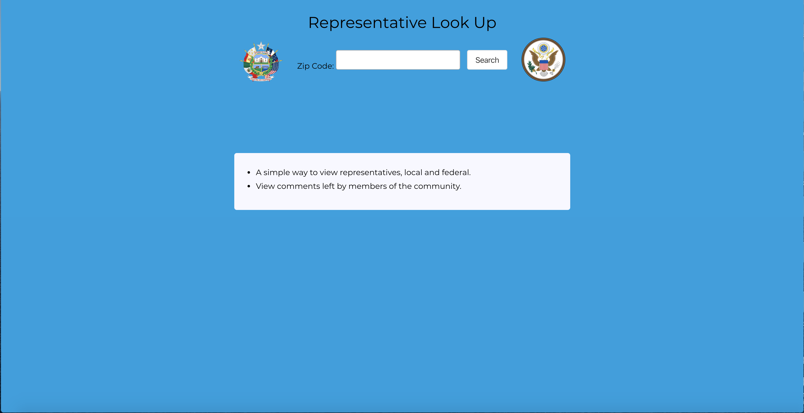

# Find elected officials and leave comments

https://quiet-meadow-10109.herokuapp.com/

This is a an app that allows the user to search for elected officials by zip code. Once the search is complete, the page will populate with cards containing information about the relevant elected officials. On each officials' card that is populated with data from the Google Civic Information API, there is an option to leave a comment. Clicking that option allows the user to leave a comment about the elected official in a modal that other users can view. The idea is that citizens will be able to inform each other about the activities of elected officials, where comments about a variety of topics are themselves the featured content. 

